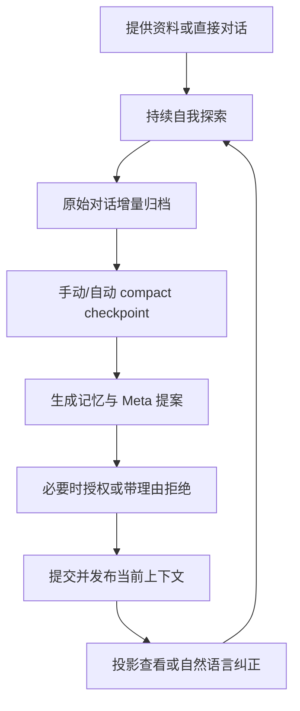

# PCO 个人认知操作系统 MRD

> 文档版本：v0.3  
> 状态：MVP 需求修订基线  
> 修订日期：2026-08-01  
> 产品代号：PCO（Personal Cognitive OS，个人认知操作系统）  
> 配套文档：PCO_PRD_v0.3

## 1. 文档目的

本文档定义 PCO 的产品定位、核心需求、目标用户、价值主张、MVP 范围与成功标准。它回答“为什么要做、为谁做、第一版必须解决什么”，不展开具体代码实现。

PCO 当前不是面向大众的商业产品，而是为其创建者本人构建的单用户系统。因此，本 MRD 不讨论市场规模、商业模式和大规模租户治理，而优先保证：

- 记忆可信、可纠正和可追溯；
- 长期对话具有认知连续性；
- 原始证据不会被模型摘要取代；
- 当前 Agent Harness 可以替换，而记忆不会随 Harness 消失；
- 记忆内核能够复用于未来的科研或其他个人 Agent OS。

## 2. 产品愿景

如果将人生视为一场已经进行了一段时间的 RPG，用户通常无法直接看到自己的“角色面板”：价值取向、心理模式、内部矛盾、反复出现的应对方式及其变化过程，大多分散在日记、对话、选择和未被主动记录的行为痕迹中。

PCO 的目标是成为一名中途加入旅程的长期同行者：

- 它没有全局视野，也不假定自己已经理解用户；
- 它只能依据用户主动提供的资料和后续对话，逐步形成对用户的认识；
- 它将推断与证据关联，允许用户纠正，并保留“认识如何发生变化”的历史；
- 它帮助用户观察自身，而不是自上而下定义用户；
- 它最终成为一面能够映照人生经历、心理模式与成长轨迹的镜子。

PCO 的长期愿景包括两类能力：

1. 对外：综合个人历史、当前状态和偏好，辅助用户作出更适合自己的决策。
2. 对内：帮助用户发现心理模式、矛盾和盲点，观察自身认识与人格侧写的演变。

MVP 只选择第二类中的一个主闭环：**自我探索——发现心理模式、矛盾与盲点。**

## 3. 问题陈述

### 3.1 现有日记的局限

传统日记主要依赖用户主动记录，存在以下问题：

- 未意识到的心理模式不会被直接写下；
- 当事人可能因防御、合理化或记忆偏差而无法如实描述；
- 信息按文档和日期分散，难以跨时期比较；
- 很难持续追踪某一心理模式、价值冲突或人物投影在多年中的变化；
- 复盘依赖用户主动阅读大量旧内容，成本高；
- 日记无法覆盖用户与 AI 长期交互中自然显露出的偏好、矛盾和改观。

### 3.2 通用 AI 对话的局限

通用 AI Coding/Agent 工具具备文件读取、搜索、模型切换和技能执行能力，但通常缺少适用于个人认知场景的长期记忆内核：

- context compaction 是有损接续，不是永久记忆；
- 单个 session 可以持续很久，但模型实际上下文仍会被压缩和替换；
- 原始对话通常锁定在具体 Harness 的本地 session 中；
- 更换 OpenCode、Codex 或 Claude Code 后，认知连续性难以迁移；
- 模型推断与原始证据之间缺少明确边界；
- 用户画像缺少稳定的纠正、revision 和历史协议；
- 纯语义 RAG 容易忽略时间顺序、变化过程和引用关系；
- 对话中形成的认识没有可靠进入下一次交互所需的长期状态。

### 3.3 仅靠结构化记忆仍然不够

事件、心理、哲学和人物投影可以帮助理解用户，但它们是 Agent 对原始资料的提炼，不应取代原始上下文：

- Agent 可能遗漏重要细节；
- 当前看似无关的对话，未来可能成为关键线索；
- 结构化解释可能被用户纠正；
- Harness 迁移时，仅靠画像无法恢复“刚才聊到哪里”；
- 如果原始消息没有独立归档，记忆将继续依赖某个 Harness 的 session 数据库。

因此，PCO 必须同时保留：

1. 原始证据层；
2. 结构化长期记忆；
3. 当前 meta-memory；
4. 用于继续当前话题的 continuation；
5. 认识和纠正的完整历史。

### 3.4 用户真正需要的能力

用户需要的不是一个“自动写日记工具”，而是一套能够持续执行以下循环的认知基础设施：

1. 接受用户主动提供的资料，或直接通过对话逐步了解用户；
2. 独立于 Harness 保存用户与 assistant 的可见对话；
3. 从事件中形成有证据的心理、哲学和人物投影关联；
4. 在对话中帮助用户探索模式与矛盾；
5. 在上下文达到阈值或用户主动要求时固化新认识；
6. 在新的认识进入当前 Meta-memory 前向用户展示证据和变化，由用户授权；
7. 继续对话时同时携带当前画像、当前话题和按需召回的历史；
8. 允许用户用自然语言纠正；
9. 永久保留历史认识，但不把已被纠正的旧认识继续当作当前画像；
10. 在未来更换 Harness 后仍能延续同一个逻辑认知旅程。

## 4. 目标用户

### 4.1 MVP 用户

MVP 只有一个目标用户：PCO 的创建者本人。

用户特征：

- 可能已经积累日记、随笔、AI 历史对话或自我分析笔记，也可能选择从纯对话开始；
- 愿意主动指定可供分析的资料；
- 能接受模型基于有限信息提出低置信度假设；
- 希望看到认识形成和变化的依据；
- 熟悉 CLI，并希望对话入口与最终观察界面共享同一套记忆；
- 接受 Windows + WSL2／Docker 的运行方式；
- 更关注架构完整性和长期演进，而非最短开发周期；
- 可能长期停留在同一个对话中，不希望依赖频繁新建 session 来刷新记忆。

### 4.2 非目标用户

MVP 不服务以下对象：

- 多用户或家庭共享场景；
- 需要医疗诊断、心理治疗或危机干预的用户；
- 希望系统自动抓取所有平台个人数据的用户；
- 只希望获得一次性人格测试结果的用户；
- 需要移动端原生应用或公众 SaaS 的用户。

## 5. 核心使用任务

### 5.1 核心 JTBD

当我积累了新的生活经历、资料或与 AI 的对话时，我希望 PCO 能结合历史证据，指出可能重复出现的心理模式、内部矛盾和认识变化，并告诉我这些判断依据什么，以便我更清楚地观察自己，而不是继续被未被意识到的模式支配。

当对话很长、Agent Harness 发生上下文压缩，或者未来更换 Harness 时，我希望 PCO 仍保留对我的长期认识、当前话题和可检索的原始上下文，而不是从头认识我。

### 5.2 主闭环

### 5.3 典型场景

#### 场景 A：有资料的首次使用

用户首次启动 PCO，按引导提供日记、AI 历史对话或已有分析笔记的读取方法。Agent 检查资料可读性，并允许用户通过后续对话继续补充背景。

系统不会在资料刚提交后强制初始化。Agent 推荐用户在准备充分时手动 `/compact`；用户也可以继续聊天，等待达到自动阈值。第一次 checkpoint 与后续 checkpoint 使用相同流程，生成：

- 第一版 meta-memory；
- 第一版 continuation；
- 事件、心理、哲学、人物投影四分类；
- 可在 AFFiNE 中浏览的观察页面。

#### 场景 B：纯对话式冷启动

用户不提供任何文件，直接与 PCO 讨论经历、困惑或关系。公开对话被持续归档。用户手动 compact 或达到自动阈值后，系统根据已有对话建立第一版记忆。

#### 场景 C：探索重复模式

用户询问：“为什么我每次准备公开自己的成果时都会拖延？”PCO 检索事件、心理概念、历史对话和时间变化，提出带证据的假设，并通过对话继续澄清。

#### 场景 D：长对话中的连续理解

用户在同一个 session 中持续聊天。上下文达到阈值后，PCO 先 consolidate；若 Meta-memory 将发生变化，用户先审阅并授权，再提交、发布新上下文并 compact。界面保留完整历史，而后续模型上下文使用最新已批准 Meta-memory、continuation、新消息和按需召回的历史。

#### 场景 E：资料更新后的增量分析

用户更新一篇日记后，主动要求 PCO 分析。PCO 比较上次成功 checkpoint 的来源快照与当前内容，只将变化及必要上下文交给 Agent，并在下一次 compact checkpoint 中提交新记忆。

#### 场景 F：纠正错误认识

用户说：“你认为我是在害怕失败，但我觉得更准确的是厌恶被评价。”PCO 理解自然语言纠正，保留原假设和改观过程，更新当前认识，但不删除历史记录。

当该判断以晋升提案出现时，用户可以选择 `No`，并在同一授权表单中填写上述反对理由或补充经历。理由为空时不能提交；提交后系统直接归档和处理，不再由 Agent 追问。

#### 场景 G：回看认识变化

用户询问：“你最初怎么看我？后来为什么改变了判断？”PCO 主动召回历史画像、相关事件和修订理由；旧画像默认不参与一般问题中的当前用户建模。

#### 场景 H：未来更换 Harness

用户从 OpenCode 迁移到另一个 Harness，或在 OpenCode 中建立新的主 session。旧 session 变为只读，新 session 通过最新 meta-memory、continuation、最近上下文和长期检索延续同一个 PCO Thread。

MVP 不自动执行迁移，但数据与身份设计不得阻碍该路径。

## 6. 产品价值主张

### 6.1 相较传统日记

- 从“主动记录了什么”扩展为“资料和交互反映了什么”；
- 将分散事件组织成可追踪的心理模式和时间线；
- 能观察跨时期变化，而不只是按日期回读；
- 保留推断、纠正和认识变化的历史；
- 将持续对话纳入人生记录，而不要求用户重复手工整理。

### 6.2 相较通用 AI 对话

- 拥有本地、永久、可检索的长期记忆；
- 原始公开对话独立于 Harness session 归档；
- 当前画像和当前话题分别维护，不把短期接续内容污染长期画像；
- 结论可回溯至具体事件、用户消息和来源资料；
- 用户纠正进入正式 revision 协议；
- Meta-memory 只有在用户审阅候选 diff 后才能生效；
- compact 成为可观察、可授权、可重试的记忆 checkpoint，而不是单纯有损摘要；
- 未来切换 Harness 时不需要从零建立认知关系。

### 6.3 相较从零搭建 Agent

- MVP 复用 OpenCode 的模型切换、文件工具、外部搜索、SKILL、权限和 session 能力；
- PCO 专注于真正不可替代的部分：记忆协议、证据归档、上下文切换、检索、巩固和观察界面投影；
- Harness Adapter 隔离 OpenCode 特性，避免整个系统被单一工具锁定；
- 通用 `mem-core` 可复用于科研或其他个人 Agent OS。

### 6.4 相较只保存摘要的记忆系统

- 摘要不是唯一证据；
- raw conversation、来源快照和结构化记忆共同存在；
- chunk 和索引可以重建，原始消息 ID 保持稳定；
- Agent 的推断失败或未来策略变化时，仍可重新分析原始证据。

## 7. MVP 产品范围

### 7.1 必须包含

1. PCO 薄 wrapper，负责拉起或连接 OpenCode。
2. 一个逻辑 PCO Thread 和一个 active OpenCode 主 session。
3. onboarding SKILL，支持提供资料和纯对话冷启动。
4. 用户与 assistant 可见消息的逐 turn、Harness 无关归档。
5. 本地 JSONL + Git canonical memory。
6. checkpoint 后发布最新已批准 Meta-memory 与 continuation 组成的上下文快照。
7. 事件、心理、哲学、人物投影四分类。
8. 用户指定资料的本地滚动快照和 diff。
9. manual/auto compact 共用的 checkpoint 流程。
10. checkpoint 期间锁定普通输入并 fork 临时 worker consolidate；需要 Meta 授权时，仅开放受限决策界面。
11. consolidate 失败阻止 compact，并允许使用同一 checkpoint 重试。
12. 混合检索：稀疏、稠密、时间、对话上下文和显式引用扩展。
13. PCO Memory Profile 定义可替换投影；MVP 以 AFFiNE 单向同步作为主要观察界面。
14. 自然语言纠正。
15. 基于 SKILL/Profile 的置信度、假设、晋升提案、Meta-memory 和 continuation 策略。
16. Meta-memory append-only JSONL 与 `user_approval` 受保护写策略；拒绝时理由／补充经历必填。
17. 通用、领域无关的 `mem-core` 与 PCO Memory Profile。
18. Git 管理的完整历史和可恢复性。
19. 为未来 Harness migration 预留稳定 Thread/epoch/binding 身份。

### 7.2 可以作为副产品提供

- 手动触发或由外部定时器触发的周度模式与矛盾报告；
- 对重复模式或重要变化的检测结果，但 MVP 不要求主动通知；
- 按时期回顾人格侧写；
- 将 `mem-core` 与 Profile 协议复用于科研 Agent OS。

### 7.3 明确不做

- 自动监控或抓取跨平台数据；
- PCO 自建 Web UI；
- 多用户、云端账户和复杂权限系统；
- 并行多个可交互 PCO session；
- OpenCode 之外 Harness Adapter 的实际实现；
- 自动 Harness migration；
- 单一永久 OpenCode session 的数据库增长治理；
- SQLite 或其他数据库作为 canonical store；
- 完整 GraphRAG；
- 自动心理诊断或治疗建议；
- 主动提醒基础设施；
- 双向同步 AFFiNE；
- 自动遗忘或删除历史认识；
- 未经 Harness 暴露而推测或还原模型隐藏 reasoning。

## 8. 产品原则

### 8.1 归因，不是定义

meta-memory 是 Agent 根据用户行为和资料自下而上形成的当前认识，不是规定用户应当如何行动的 SOUL。

### 8.2 旅伴，不是全知裁判

Agent 必须承认信息有限，区分事实、解释、假设和未知，不把单次行为上升为稳定人格结论。

### 8.3 当前认识可修改，历史认识不可抹除

用户纠正后，旧认识不再默认作为当前画像，但仍永久保留，并在解释认识演变时召回。

新的 Meta-memory revision 只有在用户明确授权后才能成为当前画像。系统可以自动提出晋升建议，但不能把“事后可纠正”当作“事前无需同意”。

### 8.4 原始证据不能被摘要取代

- 对话、来源快照和用户纠正是原始证据；
- 四分类、meta-memory 和 continuation 是不同用途的派生认识；
- assistant 文本是交互上下文，不得单独证明用户心理；
- 如果 Harness 明确暴露了可保存的 reasoning，则允许归档；
- reasoning 默认不作为用户证据，也不进入普通检索或回答上下文。

### 8.5 长期画像与短期接续分离

- meta-memory 回答“当前如何认识用户”；
- continuation 回答“当前聊到哪里”；
- 短期话题不得无条件进入长期画像；
- 两者都必须版本化和可配置。

### 8.6 时间是一等信息

所有事件、修订、消息、观察和认识变化都必须保留时间信息。MVP 采用 time-aware 检索，架构上不得阻碍未来升级为 time-native memory。

### 8.7 Context over Control

- SKILL 与 Agent 负责心理语义和认知策略；
- Profile 负责领域合同、schema、写策略、检索、backlinks、上下文渲染、投影与校验规则；
- `mem-core` 负责通用事务、append-only 存储、Git、校验调度和受保护写策略；
- 可调整策略不得硬编码进通用记忆内核；
- 数据完整性不得只依赖 Agent 遵守提示词。

### 8.8 Canonical 与派生状态分离

- Git memory 是权威状态；
- 向量、倒排、backlinks、当前 context snapshot 和 AFFiNE/Markdown 投影均可重建；
- 派生失败不回滚合法 canonical commit；
- 用户观察界面的编辑不反向改变 canonical memory。

### 8.9 Harness 是载体，不是记忆身份

- PCO Thread 独立于 OpenCode session ID；
- 同一时刻最多一个 active Harness binding；
- 未来迁移后旧 session 只读；
- 新 Harness 继承认知连续性，不必复制旧 UI 的全部历史。

### 8.10 本地记忆，最小必要上传

canonical memory、原始对话、索引和来源快照保存在本地；仅将完成当前推理所需的上下文、检索片段或资料内容发送给模型 API。

### 8.11 不遗忘

MVP 不实现自动衰减删除。低价值内容可以降低检索权重，但不能从历史中消失。

## 9. 用户体验边界

### 9.1 主要交互

- 对话与操作入口：PCO wrapper 启动的 OpenCode CLI/TUI；
- 长期观察入口：AFFiNE；
- 记忆底层文件不是常规用户界面；
- 修正入口：在 PCO 对话中自然语言表达；
- 用户不需要了解四分类 ID、JSONL、Git 或索引实现。

### 9.2 权限体验

- Agent 可通过正式 `mem` 入口修改预设记忆区；
- 四分类、hypothesis 和 continuation 等 `auto` stream 可由合规 transaction 自动提交；
- Meta-memory 是 `user_approval` stream：用户未批准前不可提交或激活；
- 选择 `No` 时必须填写理由或补充经历，空值不能提交；完成该输入后 Agent 不再追问；
- 用户创建的日记、随笔和其他原始文件，修改前必须确认；
- 记忆区以外的其他文件修改沿用 OpenCode 权限机制，默认要求批准；
- 资料来源在 MVP 中只读；
- worker 的长期写入只能通过 `mem` transaction 完成。

### 9.3 会话体验

- 用户始终在一个主 session 中持续对话；
- 退出时不再选择 suspend 或 close，也不自动 consolidate；
- 手动 `/compact` 与自动阈值触发相同 checkpoint；
- checkpoint 期间普通输入锁定；
- worker 在后台生成 changeset；存在 Meta 提案时，主会话只开放审阅、`Yes`、`No + 必填理由` 和控制命令；
- canonical commit 成功后发布新的 context snapshot，再执行 compact 并插入 receipt；
- consolidate 失败时不 compact，只允许 status、retry 或 abort；
- 用户不应在主会话中看到 worker 内部工具记录；
- OpenCode UI 保留完整历史，实际模型上下文不继续携带 compact 前原始消息。

### 9.4 首次使用体验

- onboarding 引导用户提供资料或直接聊天；
- 资料提交后不强制立即初始化；
- 用户可以继续补充背景；
- Agent 推荐合适时机手动 compact；
- 用户不手动操作时，达到自动阈值后自然产生第一次记忆 checkpoint。

### 9.5 更新反馈

每次成功 checkpoint 应向用户展示简短 receipt，至少说明：

- 新增或修订的主要记忆数量；
- meta-memory 与 continuation 是否更新；
- 是否生成晋升提案，以及批准／拒绝结果；
- canonical commit 是否成功；
- 索引和 AFFiNE 是否完成或待重试。

## 10. 成功标准

### 10.1 MVP 可用性

- 用户能够从有资料和纯对话两种路径开始使用；
- 用户无需关闭 session 即可通过 compact 更新长期记忆；
- manual/auto compact 使用同一可靠流程；
- 生成并持续更新 meta-memory、continuation 和四分类；
- 所有 Meta-memory 生效变更均经过用户授权；拒绝可以在一次条件表单中完成；
- AFFiNE 可按事件和概念浏览、反向查看关联事实；
- compact 后保持话题和认知连续性；
- 用户能通过自然语言纠正一项画像或事件解释；
- `mem-core` 可以在不修改代码的情况下加载非 PCO 测试 Profile。

### 10.2 记忆质量

- 每个关键推断能回溯至至少一个事件、用户消息或来源证据；
- 心理、哲学概念存在外部链接；
- 已被用户否定的假设不会继续作为当前画像生效；
- 被拒绝的晋升提案保留 hypothesis 历史和用户理由，但不修改 Meta-memory；
- 同一消息范围不会被重复 consolidate；
- 来源未变化时不会重复生成相同事件；
- 来源变化能够通过快照 diff 被识别；
- assistant 消息和 reasoning 不会被误当作用户证据；
- 旧对话可通过混合检索找回，而不要求全部塞回模型上下文。

### 10.3 连续性与可移植性

- OpenCode UI 保留完整历史，而模型上下文在 compact 后保持有界；
- checkpoint 将同一 ContextBundle 发布一次，Harness 后续请求自然携带该 system context，而不要求 PCO override 每次请求；
- raw conversation 在 checkpoint 之前即逐 turn 归档；
- OpenCode 异常退出不会丢失已完成 turn；
- PCO Thread ID 不依赖 Harness session ID；
- meta-memory、continuation 和检索可以由 canonical memory 重建；
- 未来更换 Harness 时不需要重建用户画像和长期证据库。

### 10.4 用户价值

在持续使用后，用户能够：

- 找到至少一个跨事件或跨对话重复出现、此前未被清晰意识到的模式；
- 理解某项当前画像由哪些经历和消息形成；
- 看到某一认识在不同时期如何变化；
- 对错误推断进行低成本纠正；
- 在长对话 compact 后感到 Agent 仍知道“我是谁”和“我们聊到哪里”；
- 感到系统是在提供镜子和假设，而不是替用户下定义。

## 11. 风险与应对

| 风险 | 影响 | MVP 应对 |
| --- | --- | --- |
| 模型过度心理化 | 把普通行为解释为稳定心理问题 | 假设分层、证据要求、用户纠正、禁止医疗诊断 |
| 错误概念或伪概念 | 形成看似专业但不可靠的解释 | 心理和哲学概念强制外部链接和搜索证据 |
| meta-memory 自我强化 | 旧结论影响新解释，形成闭环偏见 | 事实/推断分离；低置信度不进入当前画像；检索反例 |
| 未授权画像漂移 | Agent 自动改变当前用户模型，用户只能事后发现 | 自动生成提案、Meta stream 受保护、提交前 diff 授权 |
| 授权拒绝缺少信息 | 系统只知道“不对”，无法理解为何不对 | `No` 强制填写理由或补充经历，一次提交后直接归档处理 |
| assistant 输出污染用户画像 | 模型自己的说法被循环当作用户证据 | 明确证据资格；assistant 仅作交互上下文 |
| reasoning 噪声或不可用 | 不同 Harness 行为不一致，增加存储和锚定偏差 | 仅保存明确暴露的 reasoning；默认不索引、不注入、不作用户证据 |
| 来源修改后证据丢失 | 无法解释历史判断 | PCO 自有快照 + Git 历史 |
| consolidate 半完成 | canonical、索引和投影不一致 | 原子 transaction；canonical 与派生状态分离 |
| consolidate 失败阻塞 compact | 长对话无法继续释放上下文 | 提前在保守阈值触发；锁定边界；同 checkpoint 可恢复重试 |
| 对话归档与 Harness 历史重复 | 增加本地存储 | 只归档公开文本与引用；换取 Harness 独立性和可重建证据 |
| 长期 OpenCode session 膨胀 | UI 或本地数据库变慢 | MVP 接受并监控；未来通过同 Harness migration/分卷解决 |
| 隐私泄露 | 高敏感个人信息外发 | 本地存储、按需检索、禁止自动采集、最小化搜索内容 |
| 投影被用户编辑 | 展示与 canonical memory 不一致 | AFFiNE/Markdown 均明确单向；纠正必须通过 PCO |
| OpenCode API 或 hook 变化 | wrapper 与上下文合同失效 | Harness Adapter 隔离；固定版本；升级前执行一致性测试 |
| `mem` 被 PCO 领域逻辑污染 | 难以复用于科研 OS | core 仅保留通用事务/写策略；检索、backlinks 和投影属于 Profile |

## 12. 演进方向

### 阶段 1：认知 MVP

完成单用户自我探索闭环、原始对话归档、四分类、授权式 Meta-memory、continuation、快照、检索、compact checkpoint 和 AFFiNE 投影。

### 阶段 2：时间原生与模式检测

- 将状态区间、事件序列、阶段边界和因果假设升级为更强的时间模型；
- 增加跨窗口变化检测；
- 完善周报和重要变化检测；
- 基于对话与来源密度校正“未记录”偏差。

### 阶段 3：Harness migration 与会话分卷

- 自动在迁移前执行 checkpoint；
- seal 旧 session 并创建新 active binding；
- 支持 OpenCode → OpenCode、OpenCode → Codex/Claude Code 等迁移；
- 将永久 Session 的 UI/数据库增长问题转化为逻辑 Thread 下的 epoch 分卷；
- 保证认知连续性，不强制复制旧 Harness UI 历史。

### 阶段 4：通用个人 Agent OS 内核

抽取可复用的：

- PCO Thread 与 Harness binding；
- raw conversation archive；
- source checkpoint；
- memory transaction；
- evidence/provenance；
- Memory Profile；
- policy SKILL；
- profile capability dispatcher。

科研操作系统复用 `mem-core`、事务和 Harness 抽象；检索、投影、领域 schema、meta-memory 与交互技能由独立 Research Profile 提供。

### 阶段 5：更丰富的观察与角色体验

在核心记忆可信后，再考虑自建可视化、角色扮演式同行者或多种人格观察视角。该方向不进入当前 MVP。

## 13. 已锁定决策

| 议题 | 决策 |
| --- | --- |
| 第一主闭环 | 发现心理模式、矛盾与盲点 |
| 首批资料 | 日记/随笔、AI 历史对话、自我探索访谈/分析笔记 |
| 冷启动 | 同时支持提供资料和纯对话开始 |
| 部署 | Windows + WSL2／Docker |
| 模型边界 | 本地记忆库，按需发送上下文与检索内容至模型 API |
| MVP Harness | OpenCode + 薄 wrapper + SKILL + `mem` CLI |
| 长期身份 | 一个逻辑 PCO Thread，不以 OpenCode session ID 为 canonical ID |
| MVP 用户 session | 一个 active OpenCode 主 session |
| consolidate 触发 | manual/auto compact 共用 checkpoint 流程 |
| 自动触发 | 使用可配置的保守上下文比例，MVP 默认 50% |
| consolidate 期间 | 锁定主 session 普通输入；仅开放 Meta 审阅、条件授权和控制命令 |
| worker | fork 临时 session，内部记录不进入主会话；授权决定在主会话完成后回传 worker |
| consolidate 失败 | 阻止 compact，保留同 checkpoint 并允许 retry/abort |
| 退出行为 | 不触发 consolidate，不再区分 suspend/close |
| 上下文切换 | checkpoint 渲染并发布最新已批准 Meta-memory + continuation；再叠加新消息与按需召回 |
| 默认 Harness summary | 不作为 PCO continuation 使用 |
| context 发布 | 每次 checkpoint 发布一次 ContextBundle；不要求 override 每次模型请求 |
| 对话归档 | 每个完整 turn 归档 user/assistant 可见文本与引用 |
| reasoning | Harness 明确暴露时允许归档；默认不索引、不注入、不作用户证据 |
| canonical store | JSONL + Git |
| 数据库 | MVP 不使用 SQLite 作为 canonical store |
| 记忆分层 | 原始证据 + 四分类 + hypothesis + meta + continuation |
| `mem` 定位 | 通用领域无关的 append-only 事务、Git、校验与写策略内核 |
| PCO 语义 | Memory Profile + SKILL 定义；检索、backlinks、renderer 和投影均属于 Profile |
| 配置/行为 | YAML 定义编排与参数，Python 定义行为 |
| PCO Profile 检索 | Milvus dense + Tantivy sparse + RRF + 时间 + 一跳引用扩展 |
| GraphRAG | MVP 不使用 |
| 用户观察界面 | MVP 首选 AFFiNE；Profile 可替换为 Markdown 等目标 |
| 投影同步 | canonical 到 AFFiNE/Markdown 单向 |
| 原始资料 | 只读；PCO 保存本地滚动快照 |
| 置信度/晋升 | SKILL 自动生成提案；Meta JSONL 为 `user_approval` stream；用户批准后提交 |
| 拒绝晋升 | `No` 必填理由或补充经历，空值不可提交；提交后不再由 Agent 追问 |
| Meta canonical | append-only JSONL full snapshot；当前 system context 由其渲染 |
| 遗忘 | 不遗忘 |
| Harness migration | MVP 不实现，但数据和身份必须兼容；迁移前推荐手动 compact |
| 主动提醒 | MVP 不做 |

## 14. 尚未冻结但不阻塞开发的策略

以下内容故意不在 MRD 中定死，由可版本化 Profile、SKILL、配置或后续实验决定：

- 低、中、高置信度的具体阈值；
- hypothesis 自动生成晋升提案所需事件数、时间跨度和反例条件；
- meta-memory 每个区块及分卷的长度预算；
- continuation 的最终 schema、字段和最大长度；
- 对话 chunk 的 token budget 与 overlap；
- embedding 模型；
- 中文 Tantivy tokenizer；
- RRF、stream 权重和时间衰减参数；
- 外部概念来源的白名单与可信度分级；
- AFFiNE/Markdown 页面模板；
- 周报固定模板；
- Domino 是否直接用作 YAML/Python workflow runner；持久化与续跑始终由 PCO workflow 自身承担；
- 未来各 Harness Adapter 的能力降级策略。

这些策略的调整不得改变 canonical memory 的历史事实、破坏既有引用或要求修改 `mem-core` 的领域无关合同。
