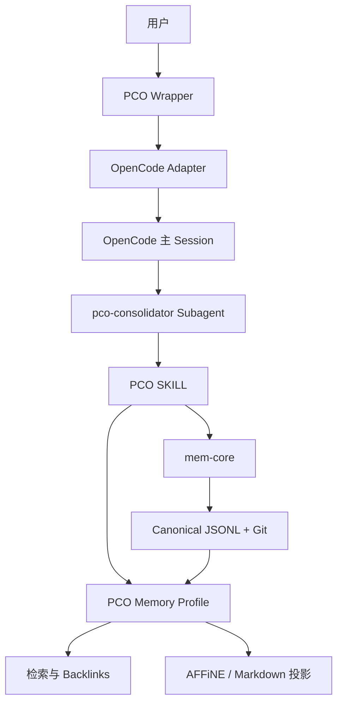
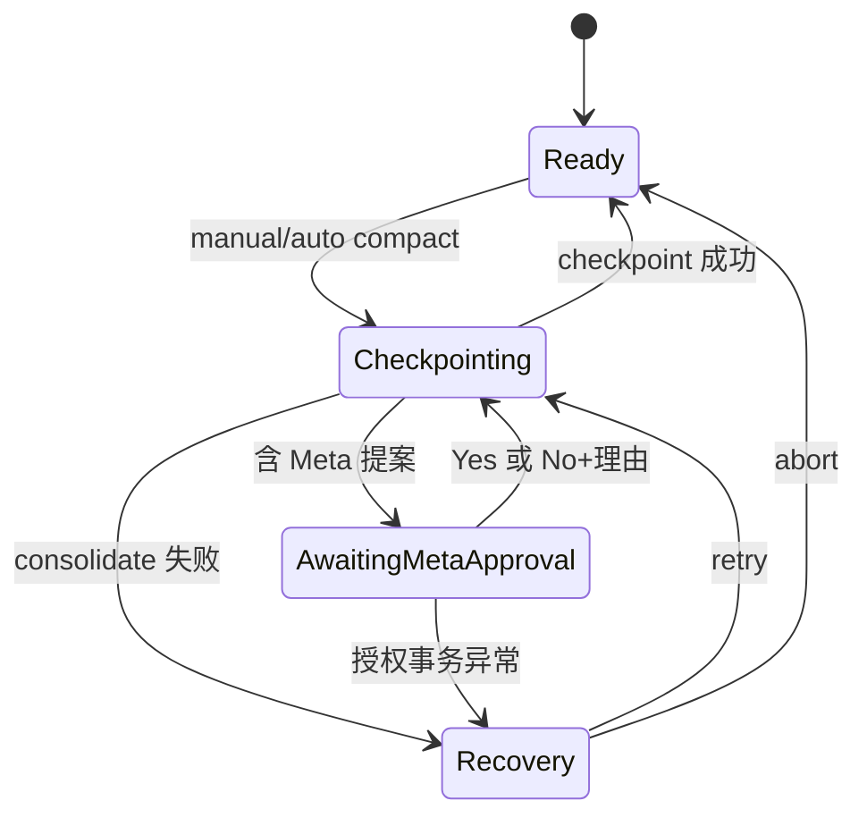

# PCO 个人认知操作系统 PRD

> 文档版本：v0.3.1  
> 状态：MVP 产品与技术需求修订基线  
> 修订日期：2026-08-01  
> 依赖文档：PCO_MRD_v0.3  
> 说明：本版本在 v0.3 基础上改用 OpenCode 原生专用 subagent 承载 consolidate worker，并删除不再适用于 JSONL full snapshot 的 Meta 分卷机制。

## 1. 产品目标

构建一套运行于 Windows + WSL2／Docker 的单用户个人认知操作系统。PCO 复用 OpenCode 作为 MVP Agent Harness，通过薄 wrapper、Harness Adapter、SKILL、通用 `mem` CLI 和本地 Git 记忆区形成长期认知闭环。

MVP 的主目标是：帮助用户在长期交互中发现心理模式、矛盾与盲点，并保留 Agent 对用户认识如何形成、变化和被纠正的历史。

MVP 必须闭合以下循环：

1. 用户进入唯一主对话，可提供资料，也可直接进行纯对话式自我探索；
2. Harness Adapter 持续归档用户和 assistant 的可见消息；
3. 用户手动执行 `/compact`，或对话达到配置阈值后自动触发同一 checkpoint 流程；
4. PCO 锁定主会话，并通过 OpenCode 原生能力启动临时 `pco-consolidator` subagent 执行 consolidate；
5. worker 生成四分类、hypothesis、continuation 以及可能的 Meta-memory 晋升提案；
6. 若提案包含 Meta-memory 变更，主会话进入授权状态：用户批准后提交；拒绝时必须同时填写理由或补充经历；
7. `mem` 根据当前 Memory Profile 校验最终 changeset，并以单个 Git commit 提交 canonical memory；
8. PCO 从已批准的 Meta-memory revision 和最新 continuation 渲染上下文快照，发布给 OpenCode 后执行 compact；
9. PCO Memory Profile 从 canonical commit 更新 Milvus、Tantivy、backlinks 和选定投影目标；
10. 主会话展示 checkpoint receipt，用户可继续对话或用自然语言纠正；
11. 所有历史永久保留，但已失效画像默认不参与当前回答。

## 2. MVP 范围与非目标

### 2.1 MVP 范围

- 单用户；
- 一个逻辑 PCO Thread；
- MVP 只绑定一个可交互的 OpenCode 主 session；
- OpenCode 内部创建临时 `pco-consolidator` subagent child session；
- 支持有资料和无资料两种冷启动；
- 首批资料包括日记与随笔、AI 历史对话、已有分析笔记和自我探索访谈；
- canonical memory 本地存储并由 Git 管理；
- 观察界面由 PCO Memory Profile 的投影目标提供；MVP 首选 AFFiNE；
- 仅向模型 API 发送当前上下文与按需召回片段；
- 检索同时覆盖结构化记忆和归档对话上下文。

### 2.2 MVP 不实现

- 多用户、多设备实时协同；
- 同时运行多个可交互 PCO session；
- Codex、Claude Code 等其他 Harness 的实际 Adapter；
- 自动执行 Harness 迁移；
- PCO 自建 Web UI；
- 数据源统一 Source Adapter；
- SQLite、知识图数据库或完整 GraphRAG；
- AFFiNE 到 canonical memory 的反向同步；
- 自动提醒服务；
- 永久主 Session 的数据库增长治理；
- 医疗诊断、心理治疗或危机干预；
- 自动删除、遗忘或改写历史记录。

## 3. 设计原则

### 3.1 Context over Control

- SKILL 和 Agent 决定“记什么、如何解释、是否提出晋升”；用户决定受保护的 Meta-memory 变更是否生效；
- `mem` 和 Validator 决定“什么变更在结构和事务上合法”；
- 不把可调整的认知策略硬编码进 `mem-core`；
- 不把数据一致性寄托于 Agent 自觉遵守提示词。

### 3.2 Canonical 与 Derived 分离

- JSONL 中的 Meta-memory revisions、来源快照、对话归档和 checkpoint 是 canonical memory；
- Milvus、Tantivy、backlinks、渲染后的当前上下文以及 AFFiNE/Markdown 页面是派生状态；
- 派生状态失败不得回滚 canonical Git commit；
- 派生状态必须可从指定 canonical commit 重建。

### 3.3 证据与解释分离

- 原始来源和用户消息是证据；
- assistant 消息是交互上下文，不能单独证明用户特征；
- 四分类和 hypothesis 是 Agent 对证据的结构化解释；
- meta-memory 是当前认识，不是对用户的定义；
- 旧解释可以被纠正或 supersede，但不能从历史中抹除。

### 3.4 用户会话与系统工作会话分离

- 用户只看到一个连续主会话；
- consolidate worker 是临时系统工作会话，不是第二个用户会话；
- worker 工具记录不合并回主会话；
- 主会话在 consolidate 期间禁止普通输入；
- Meta-memory 授权通过主会话的受限决策界面完成，不把 worker 变成前台会话。

### 3.5 Harness 可替换

- PCO Thread、canonical memory 和检索索引不以 OpenCode session 为主键；
- OpenCode 只是 MVP Harness；
- Harness 迁移改变交互载体，不改变长期记忆身份；
- 同一时刻最多存在一个 active Harness binding。

## 4. 核心术语

| 术语 | 定义 |
| --- | --- |
| PCO Thread | 跨 checkpoint、未来可跨 Harness 持续存在的逻辑认知对话 |
| Harness | 提供对话 UI、模型、工具、session 和 compaction 能力的 Agent runtime |
| Harness binding | PCO Thread 与某个 Harness 原生 session 的绑定 |
| epoch | 某个 Harness binding 的有效期；未来迁移后旧 epoch 只读 |
| main session | 当前唯一可交互的 Harness session |
| worker | 隔离执行 consolidate 的临时工作 Agent；OpenCode MVP 以专用 subagent child session 实现 |
| checkpoint | 由 manual/auto compact 统一触发的一次记忆固化与上下文切换事务 |
| compact | Harness 对实际模型上下文进行压缩和切换的动作 |
| consolidate | Agent 将尚未处理的消息、来源变化和推断转化为候选长期记忆的过程 |
| continuation | 记录当前聊到哪里、开放问题与下一步方向的短期接续摘要 |
| canonical memory | Git 管理的权威记忆，包括原始证据、结构化记忆、meta 和 checkpoint |
| meta-memory | Agent 对用户当前深层印象的压缩表示，类似自下而上推断的 SOUL |
| Memory Profile | 声明 stream、schema、写策略、Validator 与派生能力的领域包 |
| hypothesis | 尚未满足当前画像晋升条件的解释性假设 |
| promotion proposal | worker 根据当前策略自动生成、但尚未获得用户授权的 Meta-memory 变更提案 |
| approval decision | 用户对受保护变更作出的批准或带必填理由的拒绝记录 |
| context snapshot | 由最新已批准 Meta-memory、continuation 和固定指令渲染出的 Harness 上下文快照 |
| receipt | checkpoint 成功或失败后插入主会话的用户可读及机器可读结果 |
| source | 用户明确授权 PCO 读取分析的外部资料 |
| source checkpoint | 某次成功记忆事务中 Agent 实际读取到的规范化资料状态 |
| raw conversation | Harness 无关、逐 turn 归档的用户与 assistant 可见消息 |

## 5. 用户体验

### 5.1 首次启动

1. Wrapper 创建或打开唯一主 OpenCode session；
2. 加载 onboarding SKILL；
3. Agent 说明用户可以：
   - 提供日记、AI 对话或分析笔记的读取方式；
   - 继续补充背景；
   - 不提供任何文件，直接进行自我探索对话；
4. Agent 对用户声明的资料执行只读可访问性检查；
5. Agent 在信息相对充分时推荐用户手动执行 `/compact`；
6. 不要求用户立即 consolidate，也不存在 bootstrap consolidate；
7. 若用户不手动 compact，则达到自动阈值后执行第一次 checkpoint。

### 5.2 日常对话

- 用户始终在同一个主 session 中持续聊天；
- 用户无需理解四分类、JSONL 或 Git；
- 每个完整 user/assistant turn 结束后，公开消息被增量归档；
- compact 之前的新消息仍由当前 Harness 上下文直接提供连续性；
- compact 之后通过 meta-memory、continuation、最近消息和 RAG 保持连续性。

### 5.3 手动与自动 checkpoint

- 手动 `/compact` 与自动 compact 进入完全相同的状态机；
- 两者只在 receipt 中记录不同的 `trigger`；
- MVP 默认自动阈值为模型上下文容量的 50%，可配置；
- 阈值由 Harness Adapter 根据模型容量和上下文用量估算并触发；
- consolidate 失败时必须阻止 compact 并允许使用同一 checkpoint 重试。

### 5.4 退出与重新进入

- 退出 PCO 不触发 consolidate；
- MVP 不再询问 suspend 或 close；
- 下次启动重新进入唯一主 session；
- 已完成 turn 的 raw conversation 已独立归档；
- 未达到 checkpoint 的消息仍由 OpenCode 原生 session 保持。

### 5.5 用户观察与纠正

- AFFiNE 默认展示四分类、meta-memory、hypothesis 和认识变化；Profile 可切换为 Markdown 等其他单向投影；
- 主会话在 checkpoint 后插入简短 receipt；
- 用户可用自然语言纠正事实、解释、时间、关系和画像；
- 系统只能自动生成晋升提案，不能未经授权激活 Meta-memory；
- 授权界面提供 `Yes` 与 `No`：选择 `No` 后必须通过 Tab 进入理由输入框，理由为空时不可提交；
- 反对意见、自我理解和补充经历统一填写在该输入框中，Agent 不再追加追问。

## 6. 总体架构



### 6.1 组件职责

#### PCO Wrapper

- 初始化与检查环境；
- 拉起或连接 OpenCode server/TUI；
- 管理唯一 PCO Thread 和 active Harness binding；
- 加载 Harness Adapter；
- 管理 checkpoint 锁、状态、重试和恢复；
- 调度 worker、Meta-memory 授权、compact、上下文发布和 receipt；
- 将授权决定绑定到候选 transaction fingerprint；
- 不承担心理语义判断；
- 不直接修改 canonical JSONL。

#### Harness Adapter

统一封装 Harness 差异。MVP OpenCode Adapter 至少提供：

```python
class HarnessAdapter(Protocol):
    def attach_or_create(self): ...
    def archive_messages_since(self, cursor): ...
    def estimate_context_usage(self): ...
    def lock_input(self): ...
    def unlock_input(self): ...
    def spawn_worker(self, spec) -> WorkerHandle: ...
    def resume_worker(self, handle, input) -> WorkerResult: ...
    def close_worker(self, handle): ...
    def compact(self): ...
    def publish_context(self, bundle): ...
    def insert_receipt(self, receipt): ...
    def seal_session(self): ...
```

`WorkerHandle` 至少包含 PCO worker ID、Harness child session ID 和 backend 类型。OpenCode MVP 使用 `native_subagent` backend；未来 Adapter 可以使用 `child_session` 或 `independent_agent_process`，但不得把具体实现泄漏进 checkpoint、transaction 或 Memory Profile 合同。

#### OpenCode Runtime

- 提供 MVP 对话 UI、模型、工具、外部搜索、session 和 compaction；
- 加载 PCO、来源和领域 SKILL；
- 允许 PCO plugin 监听消息与 compaction 事件；
- 提供原生 subagent、child session 和 Task continuation 能力；
- 接收 checkpoint 后发布的当前上下文快照，并在后续模型请求中作为 system context 使用；
- 沿用自身权限机制。

#### `pco-consolidator` Subagent

OpenCode MVP 定义专用、默认隐藏的 `pco-consolidator` subagent，不使用拥有宽泛工具权限的通用 subagent。

- 只接收冻结的 message boundary、source diff、相关 canonical memory 和当前 Profile/SKILL；
- 通过原生 Task/child session 返回结构化 proposal；
- proposal 含 `worker_handle`、`proposal_path`、`proposal_hash`、`protected_streams` 和状态；
- 用户选择 `No` 后，通过同一 child session ID 针对本次拒绝执行一次语义续跑，读取已归档的 decision message 并生成 revised changeset；技术性失败重试不计入该业务往返限制；
- 用户选择 `Yes` 时不 resume worker，由 wrapper 直接进入受保护 transaction commit；
- 不与用户直接对话，不请求授权，不修改主 session 历史；
- 不直接执行 `mem txn commit`，结束后由 Adapter close/seal。

subagent 的工具权限必须显式配置：允许读取冻结输入、检索、外部搜索以及 proposal 的 dry-run/validate；禁止直接 Edit canonical JSONL、修改用户来源文件或绕过 Meta-memory 授权。

Wrapper 必须在进入授权状态前持久化 `WorkerHandle`、冻结输入引用和 proposal；child session 不得成为唯一工作状态。若原 child session 无法恢复，Adapter 可以用同一冻结输入、proposal hash 和 decision message ID 启动替代 worker，结果仍须满足同一幂等与校验合同。

#### PCO SKILL

- onboarding 对话；
- consolidate 的语义步骤；
- 四分类决策；
- 事实、解释、假设和未知的边界；
- meta-memory、continuation、置信度和晋升策略；
- 自然语言纠正解析；
- 心理与哲学外部引用要求；
- 调用通用 `mem` 事务接口，不直接编辑 canonical 文件。

#### 来源专用 SKILL 与 CLI

- 描述 AFFiNE、飞书或其他来源的读取方式；
- 将指定内容导出为稳定文本或结构化数据；
- `mem` 不实现各 provider 的 Source Adapter；
- `mem` 只接收已经读取和规范化的本地内容用于注册、快照与 diff。

#### `mem-core`

- profile 加载；
- 通用 append-only stream；
- transaction begin/append/validate/commit/abort/status；
- schema 和跨记录 Validator 调度；
- 临时 Git worktree 和原子 commit；
- 原始对话与来源 checkpoint 的通用写入；
- 通用 stream 写策略 `auto | user_approval | read_only` 的强制执行；
- 受保护 transaction 的授权 receipt 与 fingerprint 校验；
- 结构化错误和恢复收据；
- 不理解“心理”“哲学”“人物投影”等领域语义；
- 不内置 Milvus、Tantivy、backlinks、AFFiNE 或 Markdown 投影逻辑。

#### PCO Memory Profile

- 定义 PCO stream 与路径；
- 定义 JSON Schema、引用约束和状态规则；
- 注册 Python Validator、chunker、retriever、indexer、backlink builder、context renderer 和 projector；
- 定义各 stream 的写策略以及派生能力的调度方式；
- 定义 continuation、promotion 和 meta-memory 的可配置合同；
- 允许版本化调整而不修改 `mem-core`。

#### AFFiNE

- MVP 首选用户观察界面；
- 展示 meta-memory、四分类、hypothesis、checkpoint 与引用关系；
- 仅接受 canonical memory 单向投影；
- 用户在 AFFiNE 中的编辑不反向修改 canonical memory。

## 7. 配置与工作流

### 7.1 配置格式

- PCO 使用 YAML 配置；
- 使用 Hydra Compose API 完成配置组装与环境覆盖；
- CLI 不使用 `@hydra.main` 接管进程；
- Hydra 解析后的最终配置必须经过 Pydantic 或等价强类型校验；
- secrets 通过环境变量提供，不写入 Git；
- runtime 状态使用独立状态文件，不写入 canonical memory repo。

### 7.2 YAML 与 Python 两层

- YAML 定义编排、参数、stream、schema、写策略、索引和投影声明；
- Python 定义实际行为、Validator、workflow step、chunker 和 projector；
- YAML 只能引用 allowlist 中注册的 Python entry point；
- 每次 checkpoint 记录 profile version、policy hash 和 workflow version。

### 7.3 Domino 边界

consolidate workflow 遵循 Domino 的原则：定义编排在 YAML，行为在 Python。

- Domino 的职责是工作流编排，不承担持久化 run/step 状态；
- 断点、幂等、续跑和恢复由被编排的 PCO workflow 自身负责；
- workflow 可以在关键步骤间插入显式 I/O step，读取和保存 checkpoint 状态；
- Domino 不适合被强行扩展为持久化工作流引擎；
- MVP 可以借鉴或复用其 YAML/Python 分层，但优先使用能够清晰表达当前状态机的最小 runner；
- 无论采用何种 runner，Git 原子事务必须封装在 `mem txn commit` 内，runner 不直接拼接 JSONL 或执行零散 Git 写入。

## 8. PCO Thread 与 Harness 生命周期

### 8.1 MVP 状态



- MVP 只有一个逻辑 PCO Thread；
- MVP 只有一个 active OpenCode main session；
- 不提供新建、切换、close、suspend 或多 session 管理；
- wrapper 退出不改变 Thread 状态；
- subagent child session 不计入用户 session 数量，也不允许用户将其提升为新的 active PCO session；
- 自动 checkpoint 只在完整 turn 结束且主 session idle 时进入，避免在用户输入中途弹出授权。

### 8.2 未来 Harness migration

PCO Thread 必须支持以下数据模型，即使 MVP 不实现迁移命令：

```text
PCO Thread
├── epoch 1: OpenCode session A（sealed）
├── epoch 2: OpenCode session B（sealed）
└── epoch 3: Claude Code session C（active）
```

- 同一时刻最多一个 active binding；
- 迁移后旧 session 只读；
- 在同一个 Harness 中新开 session 也视为 migration；
- 推荐迁移前手动 `/compact`；
- MVP 不强制检查用户是否已经 consolidate；
- 未 consolidate 的公开消息因逐 turn 归档而不会丢失，但四分类、meta 和 continuation 可能尚未更新；
- 跨 Harness 必须保证认知连续性，不保证新 Harness UI 原样显示旧 UI 的全部历史。

## 9. Checkpoint 状态机

### 9.1 触发

- 手动：用户执行 `/compact`；
- 自动：上下文使用量达到 `checkpoint.trigger_ratio`；
- 默认 `trigger_ratio = 0.50`，由配置调整；
- manual 和 auto 共用同一代码路径和失败语义。

### 9.2 正常流程

```text
CHECKPOINT_REQUESTED
→ INPUT_LOCKED
→ TRANSCRIPT_FROZEN
→ WORKER_RUNNING
→ PROPOSAL_VALIDATED
→ [AWAITING_META_APPROVAL]
→ FINAL_CHANGESET_VALIDATED
→ MEMORY_COMMITTED
→ CONTEXT_PUBLISHED
→ CONTEXT_COMPACTED
→ RECEIPT_INSERTED
→ INPUT_UNLOCKED
→ DERIVATIONS_RUNNING/DONE
```

关键要求：

1. checkpoint 生成唯一 ID 和幂等键；
2. 固化 `after_message_id` 与 `through_message_id`；
3. consolidate 期间主 session 禁止普通输入；
4. Adapter 启动专用 `pco-consolidator` subagent；它只处理固定边界内尚未 consolidate 的内容；
5. worker 可以读取此前 canonical memory 和来源变化；
6. worker 输出不含 Meta-memory 变更时可直接进入最终校验；
7. worker 输出包含 Meta-memory 变更时，主会话进入 `AWAITING_META_APPROVAL`；
8. 选择 `Yes` 时，授权 receipt 与 proposal hash 绑定，受保护变更进入最终 transaction；
9. 选择 `No` 时，理由或补充经历为必填；该用户输入先通过独立 raw archive transaction 持久化，再以 decision message ID 恢复同一 subagent child session，生成不含 Meta-memory 变更的修订 changeset；Agent 不再追问；
10. Git commit 成功后，Profile renderer 从最新已批准 Meta-memory 和 continuation 生成 context snapshot；
11. `publish_context` 成功后才允许执行 compact；
12. AFFiNE、Markdown、索引与 backlinks 不阻塞主会话解锁；
13. receipt 记录 canonical、授权和派生状态。

主会话与 subagent 的业务消息交换必须有界：正常 proposal 只返回一次；`Yes` 不回传 worker；`No` 只增加一次“decision → revised changeset”往返。同一 checkpoint 的拒绝修订不得再次提出 Meta-memory 变更。

`AWAITING_META_APPROVAL` 期间普通聊天仍锁定，只允许：

- 查看提案、证据和 Meta diff；
- `Yes`；
- `No` 并填写必填理由／补充经历；
- `/pco-status`、`/pco-retry` 或 `/pco-abort`。

### 9.3 失败与重试

- Git commit 前的 consolidate、授权校验或 transaction 失败时不得执行 compact，也不推进 `last_consolidated_message_id`；
- 此时保留冻结 transcript、candidate、worker 诊断和临时事务；重试必须复用相同 checkpoint ID、消息边界和幂等键；
- Git commit 后的 context snapshot 渲染或发布失败时同样不得 compact，但 canonical commit 与 cursor 已经生效，不得重复 consolidate 或回滚；
- 该状态记为 `COMMITTED_CONTEXT_PENDING`，重试只能从 render/publish/compact 继续；
- Recovery 状态只允许 PCO 控制命令：
  - `/pco-status`；
  - `/pco-retry`；
  - `/pco-abort`；
- 普通聊天输入继续锁定；
- `abort` 仅适用于 Git commit 前：清理本次临时事务、解锁输入，但不执行 compact；commit 后只能 retry context publication；
- Agent 可恢复错误必须返回具体 JSON Pointer、错误码和建议动作。

### 9.4 派生失败

- Git commit 成功、索引、backlinks 或投影失败时 checkpoint 仍视为 canonical success；
- 状态记为 `COMMITTED_WITH_PENDING_DERIVATIONS`；
- 已提交的 Meta-memory 在 context snapshot 发布成功后激活；
- PCO Memory Profile 的派生任务可按 commit 独立恢复；
- 不因派生失败修改或回滚 canonical commit。

## 10. 实际模型上下文合同

### 10.1 compact 后必须包含

1. Harness 与 PCO 固定系统指令；
2. 最新已批准的 canonical Meta-memory snapshot；
3. 最新 continuation；
4. 最近 checkpoint 后产生的新 user/assistant 消息；
5. 当前问题按需召回的事件、概念、原始对话或来源片段。

### 10.2 compact 后不得包含

- checkpoint 边界之前的原始消息全文；
- OpenCode 默认生成的历史 continuation summary；
- 旧 meta-memory 版本；
- consolidate worker 的消息和工具输出；
- 归档 reasoning，除非用户显式请求并且策略允许；
- system/control 消息作为用户证据。

### 10.3 PCO continuation

PCO 保留 continuation 概念，但不直接使用 OpenCode 默认模板。它用于保存：

- 当前话题；
- 尚未回答的问题；
- 正在探索的矛盾或线索；
- 最近形成但尚未长期化的决策；
- 自然的下一步方向。

continuation 不进入 meta-memory，也不等同于长期画像。每次新 checkpoint 生成新 revision，旧版本永久保留但默认不注入。

### 10.4 Checkpoint 上下文发布

PCO 不要求 Adapter override 每次模型请求。每次成功 checkpoint 只发布一次新的 `ContextBundle`：

```json
{
  "checkpoint_id": "ckpt_01J...",
  "memory_commit": "abc123",
  "meta_revision": "meta_017",
  "continuation_revision": "cont_042",
  "rendered_context_path": "pco-state/context/current.md",
  "content_hash": "sha256:..."
}
```

- canonical Git commit 成功后，PCO Profile renderer 从最新已批准 Meta-memory revision 与 continuation 渲染 `current.md`；
- `current.md` 是可重建派生状态，不是 canonical memory；
- Harness Adapter 通过 `publish_context(bundle)` 将该快照设置为后续请求的 system context；
- OpenCode MVP 优先使用生成的 instruction 文件；若 Harness 提供稳定的 system-state replace/append 能力，也可由 Adapter 使用；
- 发布后，Harness 在每轮 API 请求中自然重复携带同一 system context，PCO 不在每次请求前重新读取 canonical 文件；
- 下一次 checkpoint 发布新快照并取代旧快照的当前效力，旧 Meta revision 仍保留在 canonical history；
- OpenCode 默认 continuation summary 不进入 PCO context；compact 仅保留最小 checkpoint marker，避免与 PCO continuation 重复；
- Adapter 必须通过一致性测试保证 UI 历史完整，而实际模型请求不包含 compact 前原始历史。

因此，checkpoint 后连续三轮的实际消息语义为：

1. `System(S + M2 + C2) + U1`；
2. `System(S + M2 + C2) + U1 + A1 + U2`；
3. `System(S + M2 + C2) + U1 + A1 + U2 + A2 + U3`。

## 11. 原始对话归档

### 11.1 归档时机

- 每个完整 user/assistant turn 结束后增量归档；
- 归档不等待 checkpoint；
- 归档是确定性操作，不调用 Agent 做分类或总结；
- 使用 `last_archived_message_id` 防止重复；
- consolidate 使用独立的 `last_consolidated_message_id`。

### 11.2 保存范围

只保存：

- user 可见文本；
- assistant 可见文本；
- 消息中面向用户的文件、网页、来源和记忆引用；
- Harness 明确暴露且允许保存的 reasoning；
- Harness、原生 session/message ID、时间和 Thread/epoch 信息。

不保存：

- system/developer prompt；
- 工具调用参数；
- 工具原始返回；
- Harness 内部控制消息；
- worker 消息；
- 未向 Harness 暴露的隐藏推理。

### 11.3 reasoning 规则

- 如果 Harness 明确暴露了可保存的 reasoning，则允许归档；
- 不得推测、还原或伪造未暴露 reasoning；
- reasoning 默认不进入 Milvus/Tantivy；
- reasoning 默认不注入普通回答上下文；
- reasoning 永远不能作为用户心理或经历的直接证据；
- 用户显式要求审计历史 Agent 推理时，才按权限与策略读取。

默认配置：

```yaml
conversation_archive:
  reasoning:
    archive_if_available: true
    index: false
    inject_on_recall: false
    use_as_user_evidence: false
```

### 11.4 通用消息 payload

```json
{
  "id": "msg_01J...",
  "revision": 1,
  "recorded_at": "2026-08-01T10:00:00+08:00",
  "schema_version": "conversation-message/v1",
  "payload": {
    "thread_id": "thread_01J...",
    "epoch_id": "epoch_01J...",
    "harness": "opencode",
    "native_session_id": "ses_...",
    "native_message_id": "msg_...",
    "role": "assistant",
    "kind": "conversation",
    "content": "……",
    "reasoning": null,
    "refs": [],
    "created_at": "2026-08-01T09:59:00+08:00"
  }
}
```

授权表单中的用户输入同样进入该 stream：`role = user`、`kind = checkpoint_decision`。`content` 保存拒绝理由或补充经历；decision/proposal/checkpoint ID 放入 `refs`。它属于用户证据，但不是普通聊天输入。选择 `No` 后，该 record 通过与逐 turn 归档相同的独立事务立即提交；即使后续 worker 失败，用户证据也不会丢失。

### 11.5 证据资格

- user message 可作为用户陈述的直接证据；
- assistant message 只作为交互上下文；
- 用户后续确认、否定或修正 assistant 判断时，该用户消息是高价值证据；
- assistant 对用户的推断不能循环引用自身成为新证据；
- tool/source 内容应通过 source locator 引用，不因出现在 assistant 消息中自动成为用户观点。

## 12. 来源注册、快照与 diff

### 12.1 范围

所有用户明确注册为 input 的文档均建立快照，不限于日记。

不建立快照的内容：

- provider 中未注册的其他文档；
- PCO 生成的 AFFiNE projection 页面；
- Agent 临时工作文件；
- 外部网页搜索结果全文；
- raw conversation 已归档消息。

### 12.2 来源记录

来源记录属于 PCO Profile 定义的 stream，其 payload 至少包含：

```json
{
  "source_id": "src_journal_001",
  "role": "input",
  "provider": "affine",
  "locator": "affine://workspace/page-id",
  "display_name": "2026 日记",
  "reader_skill": "affine",
  "snapshot_path": "sources/snapshots/src_journal_001.md",
  "registered_at": "2026-08-01T10:00:00+08:00",
  "status": "active"
}
```

- `locator` 记录再次读取方式；
- `reader_skill` 告知 Agent 应使用哪个外部 CLI；
- 不要求 provider 原生提供 hash；
- `mem` 对已规范化的本地内容计算 SHA-256。

### 12.3 checkpoint

1. worker 使用来源 CLI 只读获取当前内容；
2. 按来源规则规范化为稳定 Markdown 或 JSON；
3. `mem` 计算 hash 并与当前 snapshot 比较；
4. 未变化时不重复抽取；
5. 有变化时生成 diff 供 worker 分析；
6. 新 snapshot 与结构化记忆进入同一 canonical Git commit；
7. consolidate 失败时不更新 canonical snapshot。

### 12.4 快照语义

快照表示“某次成功 checkpoint 中 Agent 实际读取到的来源状态”，不是来源系统备份。旧版本由 Git 历史保留。

## 13. `mem-core`、Profile 与 SKILL 边界

| 层级 | 负责内容 |
| --- | --- |
| SKILL | 分类、解释、置信度、晋升、meta 和 continuation 的认知决策 |
| Memory Profile YAML | stream、路径、写策略、schema、派生能力和认知策略参数 |
| Profile Python | Validator、chunker、retriever、indexer、backlink builder、renderer、projector 和 workflow step |
| `mem-core` | 事务、append-only、Git、校验调度、写策略执行与结构化错误 |
| pre-commit | 使用同一 Validator 的最终 Git 防线 |

### 13.1 通用 record envelope

所有 canonical JSONL record 至少遵循：

```json
{
  "id": "stable-id",
  "revision": 1,
  "recorded_at": "2026-08-01T10:00:00+08:00",
  "schema_version": "pco/event/v1",
  "payload": {}
}
```

- `id` 是稳定实体 ID；
- `revision` 单调递增；
- 所有领域字段进入 `payload`；
- 引用结构由 Profile schema 定义；
- `mem-core` 只理解 envelope 和 profile 提供的 JSON Pointer；
- correction、supersede 和 tombstone 通过追加 revision 实现。

### 13.2 Profile 目录

```text
profiles/pco/
├── profile.yaml
├── schemas/
│   ├── event.schema.json
│   ├── psychology.schema.json
│   ├── philosophy.schema.json
│   ├── archetype.schema.json
│   ├── hypothesis.schema.json
│   ├── meta-revision.schema.json
│   └── continuation.schema.json
├── prompts/
│   ├── consolidate.md
│   ├── meta-memory.md
│   └── continuation.md
└── workflow/
    └── consolidate.yaml
```

Python entry point 由安装包注册，YAML 只引用注册名称。Profile 变更必须产生新 version 或 policy hash。

Profile 还必须声明 stream 写策略和派生能力。例如：

```yaml
streams:
  events: {write_policy: auto}
  hypotheses: {write_policy: auto}
  psychologies: {write_policy: auto}
  philosophies: {write_policy: auto}
  archetypes: {write_policy: auto}
  continuations: {write_policy: auto}
  meta_revisions: {write_policy: user_approval}

capabilities:
  retrieval: pco.retrieval:HybridRetriever
  backlinks: pco.graph:BacklinkBuilder
  context_renderer: pco.context:CurrentContextRenderer
  projections:
    affine: pco.projections:AffineProjector
    markdown: pco.projections:MarkdownProjector
```

`mem-core` 只解释通用写策略；它不理解为何 `meta_revisions` 需要授权，也不实现上述派生能力。

## 14. Canonical 与运行目录

```text
pco-memory/
├── raw/
│   └── conversations/
│       └── messages.jsonl
├── structured/
│   ├── events.jsonl
│   ├── psychologies.jsonl
│   ├── philosophies.jsonl
│   ├── archetypes.jsonl
│   └── hypotheses.jsonl
├── meta/
│   └── revisions.jsonl
├── checkpoints/
│   ├── checkpoints.jsonl
│   └── continuations.jsonl
├── sources/
│   ├── registry.jsonl
│   └── snapshots/
├── transactions/
│   └── transactions.jsonl
├── profiles/
│   └── pco/
└── .gitignore

pco-state/                    # 不进入 memory Git
├── thread.json
├── harness-binding.json
├── checkpoint-lock.json
├── workers/
├── transactions/
├── context/
│   └── current.md
└── derivations/

pco-indexes/                  # 可重建，不进入 memory Git
└── generations/
    └── <git-commit>/
        ├── milvus.db
        ├── tantivy/
        ├── backlinks.json
        └── manifest.json
```

约束：

- canonical memory 与 Profile 配置由 Git 管理；
- 运行状态、临时 worktree、credentials 和索引不进入 Git；
- MVP 不保留自由格式的永久 Agent workspace；
- worker 可以使用事务专属临时目录，但其中内容只有通过 `mem txn commit` 才能进入 canonical memory；
- `meta/revisions.jsonl` 是 Meta-memory 唯一 canonical 表示；`pco-state/context/current.md` 是由最新已批准 revision 渲染的派生文件；
- 索引 generation 绑定 Git commit，验证完成后原子切换 active manifest；
- 选用哪些索引和投影目标，以及如何调度，均由 PCO Memory Profile 定义。

## 15. PCO 结构化记忆模型

### 15.1 四分类

PCO 的四分类由 Memory Profile 定义，不属于 `mem-core` 内置概念：

1. 事件 `events`；
2. 心理概念 `psychologies`；
3. 哲学概念 `philosophies`；
4. 人物投影／原型 `archetypes`。

hypothesis、meta、continuation、source 和 raw conversation 是其他功能 stream，不构成第五分类。

### 15.2 事件 payload

```json
{
  "occurred_at": {
    "start": "2026-07-20",
    "end": "2026-07-20",
    "precision": "day"
  },
  "description": "准备公开项目成果时再次延迟发布，并在对话中表达了对被评价的厌恶。",
  "links": {
    "psychologies": ["psy_..."],
    "philosophies": ["phi_..."],
    "archetypes": ["arc_..."]
  },
  "evidence_refs": ["message:msg_...", "source:src_journal_001#heading"],
  "revision_reason": "initial extraction",
  "status": "active"
}
```

- description 可以自然包含地点、人物、感受和影响，不拆为强制字段；
- occurred_at 支持区间和不同精度；
- 无法确定时允许自然语言或 unknown；
- 相似事件和反向引用属于派生索引；
- Agent 评语不得混入事实描述，应进入 hypothesis 或其他解释性 record。

### 15.3 心理与哲学概念

payload 至少包含 name、description、aliases、external_refs 和 status。

- 每个心理或哲学概念必须至少有一个外部链接；
- 创建前 Agent 必须实际执行外部搜索；
- 外部链接证明概念有可靠出处，不证明该概念适用于用户；
- Profile Validator 校验字段、URL、访问时间和搜索 receipt；
- SKILL 判断来源质量与概念是否适用于当前证据；
- 不得将临床概念直接作为诊断。

### 15.4 人物投影／原型

范围包括现实人物、小说影视游戏角色、历史神话人物和人格化意象。

- 记录用户的喜欢、厌恶、认同或抵触及可能关联的观念；
- 只能作为探索线索；
- 不得仅凭角色偏好直接推出稳定人格结论；
- 与事件之间的 links 和 backlinks 用于观察重复关系。

### 15.5 引用关系

- 事件正向引用心理、哲学和人物投影 ID；
- canonical memory 不重复写入反向引用；
- backlinks 从正向 links 派生；
- AFFiNE 根据 canonical links 生成可点击引用和反向引用；
- 引用数量是观察线索，不等同于结论置信度。

### 15.6 hypothesis

用于保存低置信度模式、尚缺跨时期证据的解释、用户提出但未确认的理解和 Agent 与用户的分歧。

```json
{
  "statement": "用户可能更厌恶被评价，而非单纯害怕失败。",
  "confidence": "low",
  "evidence_refs": ["evt_...", "message:msg_..."],
  "counter_evidence_refs": [],
  "status": "hypothesis",
  "policy_version": "promotion@0.1"
}
```

## 16. meta-memory 与 continuation

### 16.1 Meta-memory canonical 合同

默认包含：

1. 当前深层印象；
2. 稳定偏好与价值；
3. 活跃模式；
4. 重要矛盾；
5. 近期变化；
6. 开放问题；
7. 认识边界。

要求：

- 区分观察、推断和未知；
- 低置信度 hypothesis 不立即进入；
- 不包含控制用户行为的指令；
- 不引用 worker 自身消息作为证据；
- 用户纠正不删除旧版本；
- 旧版本默认不参与当前回答；
- 只有解释“认识如何变化”时主动召回旧版本。

Meta-memory 以 append-only JSONL 保存。每个已批准 revision 推荐存储完整 snapshot，而不是只存 patch：

```json
{
  "id": "meta_current",
  "revision": 17,
  "recorded_at": "2026-08-01T10:00:00+08:00",
  "schema_version": "pco/meta-revision/v1",
  "payload": {
    "previous_revision": "meta_current@16",
    "sections": {
      "deep_impressions": [],
      "stable_preferences_and_values": [],
      "active_patterns": [],
      "important_tensions": [],
      "recent_changes": [],
      "open_questions": [],
      "boundaries": []
    },
    "change_summary": "……",
    "evidence_refs": ["evt_...", "message:msg_..."],
    "promotion_refs": ["hyp_..."],
    "approval_ref": "decision_...",
    "policy_version": "promotion@0.3",
    "status": "active"
  }
}
```

完整 snapshot 便于确定性渲染和历史读取；同一实体的修正仍通过追加新 revision 完成。

MVP 使用单一 `meta/revisions.jsonl`，不存在语义上的旧卷归档、新卷摘要或新卷引用。若未来文件规模需要 rotation/partition，只能作为对 Agent 和 Profile 透明的存储优化：不得生成语义摘要、改变 revision 顺序或影响“最新已批准 revision”的解析。

### 16.2 continuation 合同

- schema、字段、最大长度和 prompt 均由 Profile 配置；
- 代码只负责加载、校验、版本记录和激活；
- 旧 continuation 永久保留但只注入最新有效 revision；
- 默认字段可包括 current_topics、open_questions、active_tensions、recent_decisions 和 next_possible_directions；
- Profile 可以不修改 `mem-core` 地新增、删除或调整字段。

示例配置：

```yaml
continuation:
  schema: schemas/continuation.schema.json
  max_tokens: 1200
  prompt: prompts/continuation.md
```

## 17. 置信度与晋升

### 17.1 职责分离

- SKILL 定义推断与晋升过程；
- Profile 配置策略参数、schema 和 proposal 模板；
- Agent 自动生成晋升提案、候选 diff 和证据说明；
- 用户决定是否授权受保护的 Meta-memory append；
- `mem-core` 只提供通用 append/revise transaction、写策略与授权 receipt 校验；
- 不提供 `mem hypothesis add`、`mem promote commit` 等 PCO 专用命令。

### 17.2 已确认规则

- 低置信度 hypothesis 可以自动落盘；
- 不立即进入 meta-memory/system context；
- 达到策略条件时只允许自动生成 promotion proposal；
- Meta-memory stream 的写策略固定为 `user_approval`；未经授权不得 append 或激活；
- 授权界面必须展示候选 Meta diff、主要证据和 proposal hash；
- 用户选择 `Yes` 时，生成绑定 proposal hash/transaction fingerprint 的 approval receipt；
- 用户选择 `No` 时：
  - 必须按 Tab 进入理由／补充经历输入框；
  - 理由为空时 `No` 不可提交；
  - Agent 不再进行后续追问；
  - hypothesis 保留；
  - 本次 Meta-memory append 不进入 transaction；
  - 追加 hypothesis revision 并记录为 disputed/rejected；
  - 拒绝理由作为用户证据归档，并保存为 counter-evidence 或 revision reason；
  - 补充经历可以在同一 checkpoint 中进一步抽取为事件；
- 任何分歧都不得导致历史物理删除。

该流程称为“自动生成晋升提案，用户授权后晋升”，不得简称为“自动晋升”。

### 17.3 可配置参数

- 置信度计算方式；
- 独立事件数量；
- 跨时间窗口要求；
- 反例权重；
- 自动生成晋升提案的阈值；
- continuation schema 与长度；
- proposal 展示模板与授权交互文案。

每次决策记录 policy version/hash，确保未来可以解释当时为何晋升。

## 18. Consolidate 工作流

### 18.1 worker 输入

- 固定 checkpoint 消息范围；
- 当前 meta 与 continuation revision；
- 当前 PCO Profile 和 SKILL；
- 尚未处理的来源 diff；
- 按需检索的相关历史事件、概念、hypothesis 和原始对话；
- 不把旧 meta 默认当作当前画像；
- 不把 assistant 判断当作独立用户证据。

若用户拒绝 Meta-memory 提案，同一 subagent child session 通过 `resume_worker` 还接收：

- approval decision ID；
- 用户填写的拒绝理由或补充经历对应的 raw message ID；
- 原 proposal hash；
- 要求移除受保护 Meta operation、修订 hypothesis，并重新抽取新增用户证据的明确指令。

### 18.2 worker 输出

subagent worker 只生成 proposal/changeset，不直接编辑 canonical 文件。初始 proposal 使用通用 stream 操作：

```json
{
  "checkpoint_id": "ckpt_01J...",
  "transaction_id": "txn_01J...",
  "worker_handle": {
    "id": "worker_01J...",
    "backend": "native_subagent",
    "native_session_id": "ses_..."
  },
  "profile": "pco@0.3.1",
  "message_range": {
    "after": "msg_previous_cursor",
    "through": "msg_checkpoint"
  },
  "base_commit": "...",
  "operations": [
    {"op": "append", "stream": "events", "record": {}},
    {"op": "append", "stream": "hypotheses", "record": {}},
    {"op": "append", "stream": "meta_revisions", "record": {}},
    {"op": "append", "stream": "continuations", "record": {}}
  ],
  "skill_versions": {},
  "policy_hash": "sha256:...",
  "protected_streams": ["meta_revisions"],
  "proposal_hash": "sha256:..."
}
```

处理规则：

1. 无 `user_approval` operation：校验后直接形成 final changeset；
2. 有受保护 operation：wrapper 展示精确 diff 与证据并等待用户决定；
3. `Yes`：最终 changeset 必须与已展示 proposal 在受保护内容上逐字节一致，并附 approval receipt；
4. `No`：先将必填理由作为 user-authored checkpoint decision 通过独立 raw archive commit 归档；Adapter 用 decision message ID 恢复同一 subagent，基于该证据和新的 base commit 生成不含受保护 Meta operation 的新 changeset；
5. 拒绝后的新 changeset 需要重新 validate，且不得在同一 checkpoint 再生成新的受保护 Meta operation；
6. 最终 consolidated cursor 覆盖原冻结范围及本次 decision message，避免下次重复处理。

### 18.3 workflow 声明

```yaml
workflow:
  freeze:
    callable: pco.steps:freeze_transcript
  spawn_worker:
    callable: pco.steps:spawn_worker
  validate:
    callable: mem.steps:validate
  request_meta_approval:
    callable: pco.steps:request_meta_approval
  resume_after_rejection:
    callable: pco.steps:resume_after_rejection
  validate_final:
    callable: mem.steps:validate
  commit:
    callable: mem.steps:commit
  render_context:
    callable: pco.steps:render_context
  publish_context:
    callable: pco.steps:publish_context
  compact_parent:
    callable: pco.steps:compact_parent
  receipt:
    callable: pco.steps:insert_receipt
  close_worker:
    callable: pco.steps:close_worker
```

每个 step 必须接收显式输入并返回结构化结果，不依赖隐式可变全局状态。

### 18.4 幂等

`transaction_fingerprint` 至少包含：

- PCO Thread；
- Harness binding；
- message range；
- source hashes；
- base Git commit；
- profile/policy version。

初始 `proposal_hash` 冻结用户实际审阅的受保护 diff；最终 `transaction_fingerprint` 还包含 approval decision、decision message IDs、最终 base commit 和 operation set。批准 receipt 必须同时引用二者。若用户拒绝，raw decision commit 会推进 base commit，原候选 transaction 作废并基于新 commit 重新生成。

相同 fingerprint 的重复执行不得再次追加相同 record。

## 19. `mem` 事务、校验与 Git

### 19.1 建议命令面

```text
mem init
mem doctor
mem profile describe
mem profile validate
mem profile invoke <capability>

mem record get
mem record history

mem txn begin
mem txn append
mem txn validate
mem txn commit
mem txn abort
mem txn status
mem git verify
```

不存在 PCO 四分类、检索或投影专用的 core 命令。`stream`、schema 和路径来自 Profile；`mem profile invoke` 只是通用 capability dispatcher，具体的 snapshot、retrieval、backlink、index 和 projection 行为均由当前 Profile 的 allowlist entry point 实现。

### 19.2 Agent 友好合同

- 所有命令支持 JSON 输入和输出；
- stdout 只输出一个机器可解析结果；
- 日志写 stderr；
- 大文本使用 stdin 或文件路径；
- `--dry-run` 返回拟执行变更；
- 命令可安全重试；
- 错误包含稳定 code、phase、record ID、JSON Pointer、retryable 和 recovery；
- CLI 是 canonical memory 的唯一正式写入口；
- 对 `user_approval` stream 的 commit 必须携带可验证的 approval receipt；Agent 不得通过直接 Edit JSONL 绕过事务权限。

示例：

```json
{
  "code": "REFERENCE_NOT_FOUND",
  "phase": "profile_validation",
  "stream": "events",
  "record_id": "evt_123",
  "path": "/payload/links/psychologies/0",
  "value": "psy_404",
  "retryable": true,
  "recovery": ["创建 psy_404", "删除引用", "替换为已有 ID"]
}
```

### 19.3 校验层级

1. envelope 与 JSON 语法；
2. Profile JSON Schema；
3. revision、ID、引用和 source locator；
4. PCO 专用 Python Validator；
5. transaction fingerprint 与 base commit；
6. stream write policy 与 approval receipt；
7. pre-commit 再次运行同一离线 Validator。

pre-commit 是最终防线，不是主要 Agent 错误反馈入口。网络搜索、embedding、AFFiNE 和模型调用不得放进 pre-commit。

### 19.4 Git 事务

- memory repo 使用 `main` 单分支；
- 每个 checkpoint 在隔离临时 Git worktree 中准备；
- 只有 `mem txn commit` 可以合并为 canonical commit；
- 单个 checkpoint 的结构化 JSONL、source snapshot、Meta revision、continuation、approval receipt 和 transaction record 属于同一 commit；
- 逐 turn raw archive 及带理由的拒绝 decision 使用独立小事务提交，不等待 checkpoint；
- commit 前失败执行 `mem txn abort`，只清理本事务资源；
- 已 commit 错误以新 revision/correction/tombstone 修正，不 Git revert、不改写历史；
- 不执行自动 rebase、force push 或远程同步；
- 用户手动修改 canonical 文件导致 dirty/conflict 时停止并报告。

## 20. PCO Memory Profile 的检索与上下文切片

### 20.1 检索组件

- dense：Milvus，本地 MVP 可使用 Milvus Lite；
- lexical：`tantivy-py`；
- 中文分词：Profile 配置的 tokenizer；
- 融合：应用层 RRF；
- 时间：filter、window comparison 和可配置 recency boost；
- 图关系：canonical links 的一跳扩展和 backlinks；
- MVP 不采用完整 GraphRAG。

以上组件全部属于 PCO Memory Profile 的派生能力，不属于 `mem-core`。Profile 负责构建、校验、切换和查询索引 generation；wrapper/workflow 负责在 canonical commit 后按 Profile 声明调度。CLI 通过 `mem profile invoke retrieval.search` 等通用入口调用，不把实现编译进 core。

### 20.2 索引对象

- 事件当前有效 revision；
- 心理、哲学、人物投影的名称、别名和 description；
- hypothesis 的 statement；
- raw conversation 的派生 chunk；
- meta/continuation 可作为独立小索引，但默认直接按当前版本加载；
- reasoning 默认不索引；
- 旧 revision 根据历史查询模式按需进入候选，不与当前状态无区分混排。

### 20.3 对话切片

MVP 使用确定性的 turn-aware chunker：

1. 尽量保持 user message 与对应 assistant response 在同一 chunk；
2. 超长消息按段落和 token budget 拆分；
3. 相邻 chunk 默认保留一个 turn overlap；
4. 保存 message IDs、时间范围和 prev/next links；
5. chunk ID 由消息范围与 chunker version 确定性生成；
6. chunk 是派生数据，不进入 canonical Git；
7. 四分类 evidence 引用 raw message ID，不引用可重建 chunk ID。

chunker 的 token budget、overlap 和分段规则由 Profile 配置。

### 20.4 RRF

```text
score_rrf(d) = Σ 1 / (k + rank_i(d))
```

`k`、候选数、stream 权重和时间衰减全部配置化，不写入 canonical record。

### 20.5 检索模式

#### Continuity

用于恢复“刚才聊到哪里”：加载最新 continuation，并检索最近相关对话 chunk。默认优先新消息，不把 assistant reasoning 当作用户证据。

#### Current

用于回答当前画像：加载最新 meta、近期事件、活跃概念和未解决 hypothesis；旧画像默认排除。

#### Pattern

用于发现重复模式：混合召回事件与对话 chunk，经 backlinks 和 links 扩展，同时检索反例和 disputed hypothesis，并关注跨时间重复。

#### Historical

用于历史回看：按时间过滤事件、对话和当时 meta revision，区分“当时记录”与“后来解释”。

#### Change

用于变化分析：比较多个时间窗口的事件、对话密度、概念关联、反例和 meta revisions，避免把“没记录”误判为“不存在”。

### 20.6 检索返回合同

PCO Profile 的 `retrieval.search` capability 至少返回：

- stream、record/chunk ID 和 revision；
- text；
- occurred/created/recorded time；
- dense、lexical、RRF 和时间子分数；
- evidence refs；
- links；
- 是否为当前有效 revision；
- 命中的检索模式；
- assistant context 与 user evidence 的资格标记。

默认只向模型发送片段；需要核实时再沿 message ID 或 source locator 读取上下文。

## 21. PCO Memory Profile 投影

投影是 Profile 声明的可替换派生能力。MVP 默认启用 AFFiNE；同一 canonical memory 可以改为投影到本地 Markdown，且无需修改 `mem-core`。投影调度、幂等键、backlinks 渲染和目标端 page/file ID 映射都由 Profile projector 负责。

### 21.1 页面结构

- PCO 首页／当前人格侧写；
- 事件索引；
- 心理概念索引；
- 哲学概念索引；
- 人物投影／原型索引；
- hypothesis／待验证认识；
- 认识变化时间线；
- checkpoint 更新记录。

### 21.2 实体同步

- 每个实体 ID 对应一篇 AFFiNE 文档；
- revision 1 创建；
- 同 ID revision 追加到同一文档；
- 页面展示 revision、时间、description、修改原因、关联概念和可显示 evidence locator；
- concepts 展示 external refs 和关联事件；
- meta 首页展示当前用户可读版本和 revision 变化摘要；
- continuation 默认不作为人格侧写展示，可在 checkpoint 页面查看。

### 21.3 单向与幂等

- canonical memory 是唯一事实源；
- AFFiNE 编辑不回写；
- 用户纠正必须回到 PCO 对话；
- 每个 AFFiNE 文档保存 PCO entity ID；
- 同步按 Git commit 和 entity ID 幂等；
- 同步失败不重复创建页面。

### 21.4 可替换目标

- `projection.target: affine`：MVP 默认，承担用户观察入口；
- `projection.target: markdown`：将同一实体和 revision 单向渲染为本地 Markdown；
- 后续目标通过 Profile entry point 增加；
- 所有目标均为 canonical → projection 单向同步；
- 切换目标不得改变 JSONL schema、Git 历史或 Meta-memory 授权语义。

## 22. 自然语言纠正

支持：

- 修正事件时间、人物和关系；
- 否定心理解释；
- 合并重复事件；
- 保留 hypothesis 但不进入当前画像；
- 声明旧判断已不适用；
- 反对晋升提案，并在同一授权表单中提供理由或补充经历。

流程：

1. Agent 识别实体和意图；
2. 检索候选 ID；
3. 有歧义时确认；
4. 普通纠正生成新 revision、correction 或 disputed hypothesis proposal，并通过下一个 checkpoint 提交；
5. checkpoint 授权表单中的拒绝理由由当前 checkpoint 直接归档并处理，不等待下一个 checkpoint；
6. 旧 record 和旧 meta 永久保留；
7. receipt 告知纠正结果。

禁止：

- 物理删除历史；
- 把用户否定改写成 Agent 从未形成过判断；
- 未定位实体时猜测性修改；
- 因纠正丢失原证据；
- 将用户反对理由隐藏在非 canonical worker 日志中。

## 23. Receipt 合同

checkpoint 成功后主会话至少显示：

```text
记忆 checkpoint 完成：
- 新增事件：3
- 新增 hypothesis：1
- 晋升提案：1；已批准：1；已拒绝：0
- meta-memory：已更新
- continuation：已更新
- Git commit：abc123
- 索引：完成
- AFFiNE：待同步
```

receipt 同时保存机器可读 payload：

- checkpoint/transaction ID；
- trigger；
- message range；
- operation counts；
- promotion proposal、approval decision 和 proposal hash；
- meta/continuation revisions；
- Git commit；
- index/AFFiNE 状态；
- warning/error/recovery。

Meta-memory 授权结果必须足够显著。选择 `No` 时，wrapper 在提交前强制填写理由；提交后 Agent 不再追问。

## 24. 权限、隐私与安全

### 24.1 文件权限

- 预设记忆区和 PCO 运行状态目录：允许 PCO 创建和修改；
- 用户原始资料：只读，修改前必须确认；
- 其他文件写入：沿用 OpenCode 权限机制并要求批准；
- 来源 CLI 默认只读；
- subagent worker 只能生成和校验 proposal，不得直接修改 canonical memory 或执行 `mem txn commit`；
- `meta_revisions` 使用受保护写策略：只有携带与候选 diff 匹配的用户 approval receipt，`mem txn commit` 才允许写入；
- 若 Harness 原生权限 UI 无法表达“拒绝理由必填”，PCO wrapper 必须提供该条件表单，再将结果传给受保护 transaction；
- Profile Python entry point 必须 allowlist。

### 24.2 模型边界

- canonical memory、Git、索引和快照均在本地；
- 模型 API 只接收当前上下文、固定 checkpoint 范围或按需召回片段；
- 大型资料允许按批读取；
- 外部搜索不得无必要包含用户身份和敏感原文；
- provider、模型、发送范围和 reasoning 可用性写入本地 transaction metadata。

### 24.3 凭据

- AFFiNE、模型和来源凭据不得写入 Git；
- 使用环境变量或本地 secret 配置；
- stdout、stderr 和 transaction receipt 不得泄露 token；
- memory repo 默认无远程仓库；
- 用户自行启用远程时不改变 PCO 的本地隐私承诺。

## 25. 非功能需求

### 25.1 可靠性

- consolidate 与 Git commit 原子、幂等、可恢复；
- checkpoint 失败不执行 compact；
- 合法历史 record 永不丢失；
- raw message、source、structured record、meta 和 continuation 可追溯到 transaction；
- 派生状态可从 canonical commit 重建；
- OpenCode 升级前必须运行 context-publication 与 compact conformance tests。

### 25.2 可解释性

- 当前画像的重要结论必须能定位 evidence；
- 回答区分事实、解释、假设、反例和未知；
- 用户能查看认识形成与变化原因；
- 当前 Meta-memory 的每次生效变更都能定位到明确用户授权；
- assistant 消息和 reasoning 不得伪装为用户证据。

### 25.3 可移植性

- 首选 WSL2，可选 Docker；
- memory repo 是普通目录，可备份、迁移和重建；
- PCO Thread ID 不依赖 OpenCode session ID；
- Harness Adapter 与 `mem-core` 分离；
- Profile 与 SKILL 可以替换为科研 OS 等其他领域包。
- Profile 的 retrieval、backlinks、renderer 和 projection 可独立替换，不要求修改 `mem-core`。

### 25.4 性能参考

- 10,000 个事件；
- 100,000 条公开对话消息；
- 5,000 个 concept/hypothesis revision；
- 1,000 个来源 checkpoint；
- 本地普通检索 2 秒内返回候选；
- 不含模型调用的 validate/commit 在 10 秒内完成；
- 性能优化不得破坏证据和 revision 正确性。

### 25.5 可观测性

每个 checkpoint 至少记录：

- trigger 和状态；
- 开始/结束时间；
- Thread、Harness binding、parent session、worker backend 与 subagent child session；
- message range 与 archive cursor；
- source hashes；
- model、Harness 与 reasoning capability；
- profile、workflow、SKILL 和 policy versions；
- operation counts；
- proposal hash、受保护 stream 和 approval decision；
- Git commit；
- meta/continuation revisions；
- index/AFFiNE 状态；
- 错误码、retry 次数与 recovery。

## 26. 验收场景

### AC-01 有资料首次使用

用户提供日记读取方式并继续补充背景；系统不自动初始化。用户手动 `/compact` 后完成第一次 consolidate、Git commit、meta、continuation、四分类和 receipt。

### AC-02 纯对话冷启动

用户不提供任何文件，持续进行自我探索；达到自动阈值后执行与手动完全相同的 checkpoint，并生成第一版记忆。

### AC-03 自动与手动一致

相同输入范围分别由 manual/auto 触发时，进入相同状态机、Validator 和 commit 路径，仅 trigger 字段不同。

### AC-04 对话逐 turn 归档

在尚未发生 checkpoint 时异常退出，已完成 user/assistant turn 仍存在于 raw conversation；system、tool raw output 和 worker 消息未被归档。

### AC-05 reasoning 可选归档

Harness 暴露 reasoning 时按配置归档但不索引、不作为用户证据；Harness 不暴露时系统正常工作且不生成伪造 reasoning。

### AC-06 compact 后上下文

OpenCode UI 仍显示完整历史；checkpoint 只调用一次 `publish_context`，之后实际模型请求包含已发布的最新 Meta、continuation、checkpoint 后消息和按需召回片段，不包含旧原始对话或默认 continuation summary。

### AC-07 worker 隔离

checkpoint 锁定主输入并启动专用 `pco-consolidator` subagent；worker 工具日志不进入主 session；若需要 Meta 授权，仅主会话显示候选 diff 和决策表单。`Yes` 不恢复 subagent；`No` 以已归档 decision message ID 对同一 child session 执行一次语义续跑并返回 revised changeset；若 child 不可恢复，可从持久化冻结输入确定性重建 worker；成功后 worker 被回收。

### AC-08 consolidate 失败

非法引用导致 validate 失败，compact 不执行、cursor 与 canonical memory 不推进；普通输入保持锁定，使用 `/pco-retry` 后以相同 checkpoint 完成。

### AC-09 派生失败

Git commit 成功但 AFFiNE 失败时 meta 立即激活，receipt 标记 pending；重试不重复创建页面。

### AC-10 来源 diff

用户更新已注册文档后触发 checkpoint，系统识别变化；未变化来源不重复抽取。

### AC-11 自然语言纠正

用户否定心理解释并提供理由后，原 hypothesis 永久保留但进入 disputed，新 meta 不继续使用该判断。

### AC-12 授权式晋升

hypothesis 达到当前 Profile/SKILL 条件后自动生成 promotion proposal，但在用户通过 OpenCode 原生 question form 选择固定批准项并由 Plugin 生成匹配的一次性 host grant 前无法写入 Meta-memory。选择 Other 后必须提交非空理由或补充经历；该原文直接绑定 No grant 并作为 `question:<question_request_id>` 的用户 evidence 归档。空值、dismissal、模型直接调用 approve/reject、错误 session/proposal/challenge/request、过期或重放 grant 均 fail closed；提交后不再出现 Agent 追问，Meta 不变，hypothesis 追加 disputed/rejected revision。Yes 不生成合成的 `role=user` conversation message。

### AC-13 历史认识

普通当前状态问题不召回已失效画像；询问“认识如何变化”时可以召回旧 meta revision、当时 policy version 和修订原因。

### AC-14 概念外部引用

没有外部链接或搜索 receipt 的心理／哲学概念无法通过 PCO Profile Validator。

### AC-15 混合检索

continuity、current、pattern、historical、change 查询能够分别检索结构化记录和对话 chunk，并返回 evidence ID、时间和资格标记。

### AC-16 Profile 解耦

使用测试 Research Profile 创建新 stream，声明不同写策略及 retrieval/projection capability，并完成 append、validate、commit 和 capability invocation，无需修改 `mem-core` 代码。

### AC-17 投影目标可替换

同一 canonical commit 可分别投影到 AFFiNE 和本地 Markdown；切换目标无需迁移 canonical memory，任一投影失败都不回滚 commit。

## 27. 开发分期

### P0：`mem-core` 与 Profile 协议

- 通用 envelope；
- Profile YAML/Python 加载；
- JSON Schema 与 Validator runner；
- transaction、Git worktree、commit/abort；
- `auto | user_approval | read_only` 写策略与 approval receipt 校验；
- pre-commit 复用校验；
- 结构化错误。

完成标准：使用两个测试 Profile 完成同一通用事务，不出现领域专用 `mem` 代码。

### P1：原始证据层

- raw conversation schema；
- OpenCode 消息增量归档；
- reasoning capability 处理；
- source registry、snapshot、hash 和 diff；
- archive/consolidate 双 cursor。

完成标准：AC-04、AC-05、AC-10 通过。

### P2：OpenCode Wrapper 与 Adapter

- server/TUI 启动与绑定；
- 单 PCO Thread；
- context usage 估算和阈值触发；
- manual/auto compact 汇合；
- 主输入锁；
- 原生 `pco-consolidator` subagent 的 spawn/resume/close；
- 显式 subagent 工具权限与结构化 result contract；
- checkpoint context renderer 与 `publish_context`；
- Meta proposal 条件授权表单；
- receipt 注入。

完成标准：AC-03、AC-06、AC-07、AC-08 通过。

### P3：PCO Profile 与 consolidate SKILL

- onboarding；
- 四分类 schema；
- hypothesis、meta、continuation；
- append-only Meta revision snapshot；
- 外部引用 Validator；
- 自然语言纠正；
- promotion proposal 与拒绝证据回流；
- YAML/Python workflow。

完成标准：AC-01、AC-02、AC-11、AC-12、AC-14 通过。

### P4：PCO Profile 检索

- Milvus；
- Tantivy；
- turn-aware chunker；
- RRF；
- backlinks；
- 五种检索模式；
- 时间过滤和 evidence qualification。

以上能力通过 Profile entry point 与通用 dispatcher 提供，不进入 `mem-core`。

完成标准：AC-15 通过，回答可返回 raw message/event/source evidence。

### P5：Profile 投影

- 首页；
- 四分类和 hypothesis 页面；
- meta 变化；
- checkpoint receipt；
- links/backlinks；
- revision append；
- retry 和幂等；
- Markdown projector smoke test。

完成标准：AFFiNE 可以承担主要观察入口，AC-09 通过。

### P6：质量与可移植性验证

- 固定测试资料；
- 事件抽取一致性；
- 重复事件检测；
- hypothesis 误晋升；
- meta/continuation 回归；
- context-publication/compact conformance；
- Profile 解耦测试；
- 故障和隐私演练。

## 28. MVP 发布门槛

只有满足以下条件才视为 MVP 完成：

- P0–P5 核心能力完成；
- AC-01 至 AC-17 通过；
- canonical memory 可从 Git clone 后重建 Milvus、Tantivy、backlinks 和 AFFiNE；
- 有资料和纯对话冷启动各完成一次成功 checkpoint；
- manual/auto compact 共用同一可靠路径；
- consolidate 失败演练不会执行 compact 或损坏 memory repo；
- compact 后实际模型请求不携带旧原始历史；
- 至少一次来源 diff、自然语言纠正、Meta 提案批准与带必填理由的拒绝完成；
- 使用非 PCO 测试 Profile 验证 `mem-core` 复用；
- 用户可仅通过 OpenCode 对话、授权表单和 AFFiNE 完成主闭环，无需手工编辑 JSONL。

## 29. 后续待定与未来能力

以下内容不阻塞 MVP 骨架：

- promotion SKILL 的定量规则；
- continuation 最终 schema 与长度；
- 单个 Meta snapshot 及其各 section 的上下文渲染预算；
- embedding 模型；
- 中文 Tantivy tokenizer；
- RRF、stream 权重和时间衰减参数；
- AFFiNE/Markdown projector 的最终实现与页面模板；
- 超大来源的分块 snapshot；
- 周报 SKILL；
- time-native memory schema；
- 单永久 Harness session 的数据库增长治理；
- 自动 Harness migration 命令；
- Codex、Claude Code 等 Adapter；
- Harness 不支持原生 subagent 时的 child session 或独立 Agent process worker backend；
- 是否直接使用 Domino 作为 YAML/Python 编排 runner；
- 科研 OS 等其他 Memory Profile。
